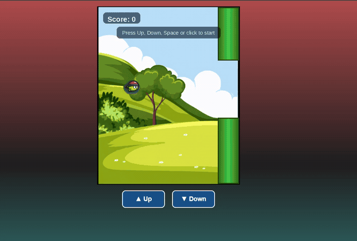
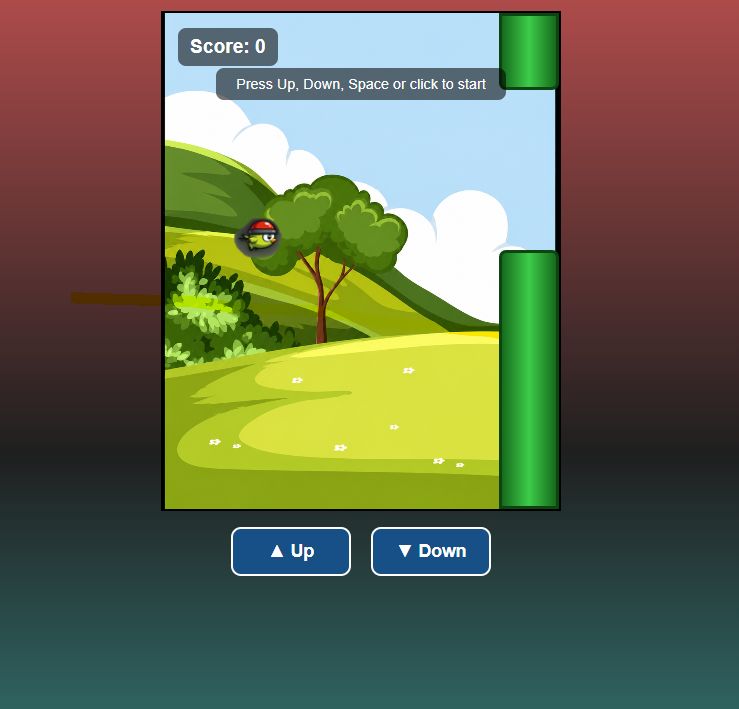
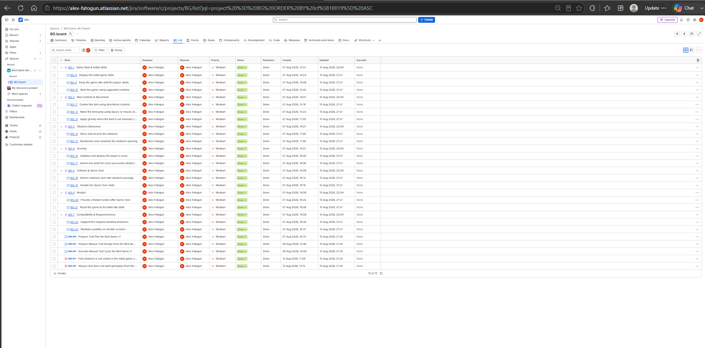
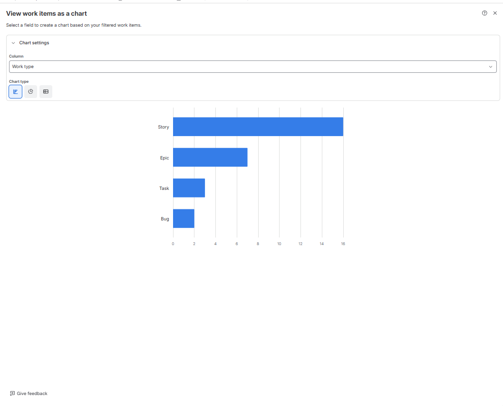
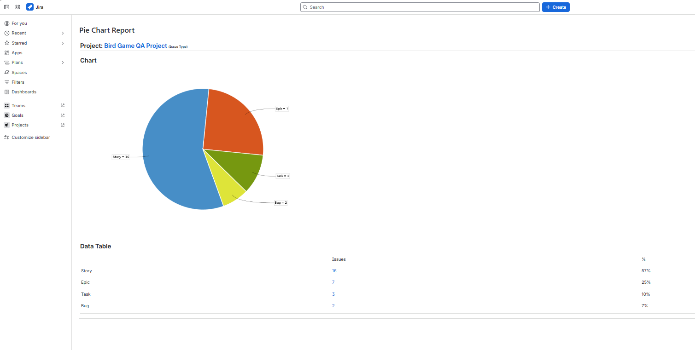
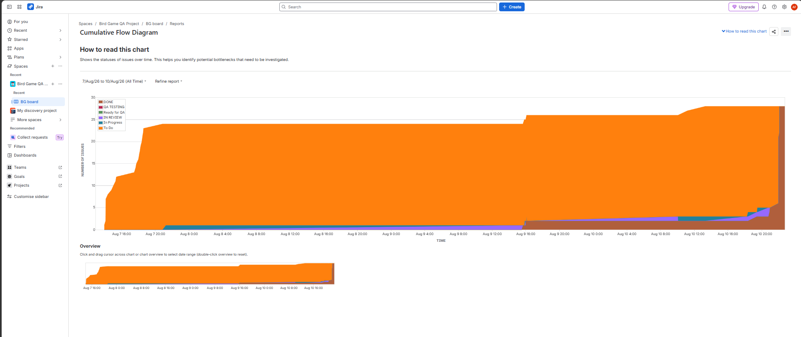
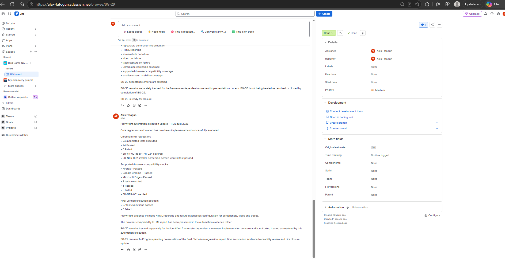

# Bird Game QA Portfolio

[](https://github.com/alex3381/bird-game-qa-portfolio/actions/workflows/playwright.yml)

An end-to-end **software testing and QA automation portfolio project** in which I designed and built a browser-based JavaScript Bird Game, then applied a structured QA lifecycle covering requirements analysis, test planning, manual testing, exploratory testing, Jira defect management, traceability, cross-browser testing, Playwright automation, Git/GitHub version control and CI with GitHub Actions.

---

## Gameplay Demo



▶️ [View the 7-second MP4 gameplay demo](14_PORTFOLIO_MEDIA/Bird_Game_Gameplay_Demo_7s.mp4)

> **Note:** The GIF and MP4 are visual gameplay demonstrations created for portfolio presentation. Formal QA execution evidence is retained separately within the test execution, defect, Jira and Playwright evidence folders.

---

## Game Design & Implementation

I designed and built the Bird Game as a compact browser application that could act as a realistic system under test for this QA portfolio.

The game was developed using **HTML, CSS and JavaScript**. HTML provides the application structure, including the bird, obstacle, score display, player instructions, on-screen controls, game-over screen and restart function. CSS provides the game layout, background, pipe styling, bird positioning, interactive controls and smaller-screen support. JavaScript implements the core game behaviour, including gravity, jumping, continuous Up/Down movement, keyboard and pointer input, obstacle movement, randomised pipe gaps, collision detection, scoring, game-over handling and restart behaviour.

The main game loop is driven with `requestAnimationFrame`, while the state of the bird, obstacle, score and game lifecycle is managed in JavaScript.

I deliberately kept the application small enough to understand at code level while giving it enough behaviour and state changes to support realistic **requirements analysis, test design, manual execution, exploratory testing, defect investigation, regression testing, browser compatibility testing and Playwright automation**.

Defects and technical limitations discovered during testing were handled through the same QA process documented in this repository rather than being hidden. This includes the BG-27 first-obstacle visibility defect and the BG-30 frame-rate-dependent movement limitation.

Application source:

[`12_APPLICATION_UNDER_TEST/source`](12_APPLICATION_UNDER_TEST/source)

---

## Project at a Glance

| Area | Final Position |
|---|---|
| Application | Browser-based Bird Game built with HTML, CSS and JavaScript |
| Functional requirements | BR-FR-001 to BR-FR-024 covered |
| Non-functional requirements | BR-NFR-001 and BR-NFR-002 covered |
| Manual test cycle | 41/41 planned tests executed |
| Initial manual result | 38 Pass, 2 Fail, 1 Blocked |
| Manual closure | 40 confirmed Pass + 1 Not Reproducible observation |
| Open manual Fail / Blocked | 0 / 0 |
| Chromium automated regression | 24/24 Passed |
| Browser compatibility automation | Firefox, Google Chrome and Microsoft Edge — 3/3 Passed |
| Final local automated executions | 27 Passed, 0 Failed |
| Jira automation task | BG-29 Done |
| Known technical issue | BG-30 — Known Issue / Deferred |
| GitHub Actions | Automated regression workflow configured and passing |

---

## What This Project Demonstrates

- Application design and implementation using HTML, CSS and JavaScript
- Requirements analysis and testability review
- Test planning and scope definition
- Test scenario design
- Detailed manual test-case design
- Test data preparation
- Manual functional testing
- Exploratory testing
- Browser compatibility testing
- Smaller-screen usability testing
- Defect reporting and investigation
- Retesting and regression testing
- Jira workflow management
- Requirements Traceability Matrix development
- Playwright automation using JavaScript
- Cross-browser automated verification
- Failure diagnostics using screenshots, video and traces
- Git and GitHub version control
- GitHub Actions continuous integration
- Evidence-led QA reporting
- Transparent management of unresolved technical risk

---

## System Under Test

The Bird Game requires the player to control a bird through moving pipe obstacles while avoiding collisions and increasing the score.

Testing covered:

- initial game state;
- supported start controls;
- Up Arrow and Down Arrow movement;
- Space key jump;
- mouse-click jump;
- on-screen controls;
- gravity;
- obstacle movement;
- obstacle reset;
- randomised gap position;
- gap boundaries;
- scoring;
- collision detection;
- game-over behaviour;
- restart behaviour;
- browser compatibility;
- smaller-screen usability.

### Verified Application State



The screenshot above is retained from the **BG-27 retest evidence** after the first-obstacle visibility defect was corrected.

---

## QA Test Approach

The project followed a structured software testing lifecycle.

### 1. Requirements Analysis

Functional and non-functional requirements were reviewed for clarity, coverage and testability.

The baseline contains:

- **24 Functional Requirements** — BR-FR-001 to BR-FR-024
- **2 Non-Functional Requirements** — BR-NFR-001 and BR-NFR-002

### 2. Test Planning

A formal test plan documented:

- scope and objectives;
- test approach;
- test environments;
- entry and exit criteria;
- risks;
- defect handling;
- reporting;
- completion criteria.

### 3. Test Design

The project includes:

- test scenarios;
- detailed test cases;
- test data;
- expected results;
- browser compatibility coverage;
- exploratory test charters;
- requirements traceability.

### 4. Manual Test Execution

All planned manual test cases were executed and evidence was retained for failures and retests.

### 5. Defect Management

Defects and test observations were investigated through Jira, retested where appropriate, and given evidence-supported dispositions.

### 6. Regression & Automation

Stable functional behaviour was automated using Playwright.

### 7. Test Completion

Final results, defect status, traceability, automation evidence and known technical limitations were documented for portfolio release.

---

## Manual Testing Results

A total of **41 manual test cases** were planned and executed.

### Initial Execution

| Result | Count |
|---|---:|
| Pass | 38 |
| Fail | 2 |
| Blocked | 1 |
| Not Run | 0 |
| **Total** | **41** |

**Initial pass rate: 92.68%**

### Final Manual Closure

Following defect investigation and retesting:

- **40 confirmed Pass**
- **1 observation closed as Not Reproducible**
- **0 open Fail**
- **0 Blocked**

Final execution log:

[`Bird_Game_Test_Execution_Log_v1.0_FINAL_CLOSED_2026-08-10.xlsx`](09_TEST_EXECUTION/Execution-Results/Bird_Game_Test_Execution_Log_v1.0_FINAL_CLOSED_2026-08-10.xlsx)

---

## Defect Management

| Defect | Final Outcome | QA Disposition |
|---|---|---|
| **BG-27** | Fixed | First obstacle was not visible at initial load. Targeted retest passed. |
| **BG-28** | Not Reproducible | Mouse-click start observation. Controlled Chromium retest passed 20/20 without a BG-28-specific application change. |
| **BG-30** | Known Issue / Deferred | Game movement remains dependent on browser/display frame rate because movement uses fixed values per animation frame. |

Final defect summary:

[`Bird_Game_Final_Defect_Status_Summary_2026-08-11.md`](07_DEFECT_MANAGEMENT/Defect-Reports/Bird_Game_Final_Defect_Status_Summary_2026-08-11.md)

### BG-27 — First Obstacle Visibility

The first obstacle initially started completely outside the visible game area. The implementation was corrected and the affected test cases passed targeted retesting.

Evidence:

[`09_TEST_EXECUTION/Execution-Evidence`](09_TEST_EXECUTION/Execution-Evidence)

### BG-28 — Mouse-Click Start Observation

A manual execution initially indicated that mouse click did not start the game. Controlled follow-up testing was performed using Chromium:

**20 attempts / 20 Passed**

No BG-28-specific source-code change was introduced, so the observation was closed as **Not Reproducible**.

### BG-30 — Frame-Rate-Dependent Movement

Automation analysis identified that movement calculations use fixed values per `requestAnimationFrame` callback. This means gameplay speed may vary with browser/display rendering frame rate.

The issue is retained transparently as:

**KNOWN ISSUE / DEFERRED**

A future implementation improvement would use elapsed-time/delta-time-based movement calculations followed by a dedicated regression and frame-rate consistency test cycle.

---

## Jira Project Management

Jira was used to manage:

- Epics
- User Stories
- QA Tasks
- Defects
- Manual execution work
- Automation work
- QA workflow transitions

The project workflow included:

**To Do → In Progress → In Review → Ready for QA → QA Testing → Done**

### Jira Project Hierarchy



Requirement-linked Jira stories covered:

- Game Start & Initial State
- Bird Controls & Movement
- Obstacles
- Scoring
- Collision & Game Over
- Restart
- Browser & Screen Compatibility

Historical Jira evidence and exports are retained under:

[`00_PROJECT_MANAGEMENT/JIRA`](00_PROJECT_MANAGEMENT/JIRA)

---

## Jira Reporting & Project Metrics

The Jira reporting screenshots below are preserved as **historical project evidence captured on 10 August 2026**. They show the project composition and workflow position at that stage. The later automation-phase Jira items **BG-29** and **BG-30** were added afterward, so these reports are intentionally retained as contemporaneous evidence rather than being retrospectively altered.

### Work Items by Type — Bar Chart



This chart provides a quick comparison of the Jira work-item types used to organise requirements, QA activities and defects.

### Work Items by Type — Pie Chart



The pie chart provides a part-to-whole view of the Jira project structure at the time the report was captured.

### Cumulative Flow



The cumulative-flow report is retained as evidence of work progressing through the Jira workflow during the project.

Additional Jira reporting evidence:

[View Jira Reports Overview](00_PROJECT_MANAGEMENT/JIRA/Sprint-Evidence/Jira_Reports_Overview_2026-08-10.png)

---

## Automation Task — BG-29



BG-29 covered implementation and verification of the Playwright regression suite.

Final status:

**DONE**

---

## Playwright Automation

The automation framework is located at:

[`10_AUTOMATION/Playwright`](10_AUTOMATION/Playwright)

The suite uses:

- Playwright
- JavaScript
- Node.js
- npm
- Chromium
- Firefox
- Google Chrome
- Microsoft Edge
- Playwright HTML Reporter
- screenshots on failure
- video on failure
- trace capture on failure

### Final Automation Results

#### Chromium Full Regression

**24 Passed / 0 Failed**

Coverage includes:

- BR-FR-001 through BR-FR-024
- BR-NFR-002 smaller-screen usability

#### Cross-Browser Compatibility

| Browser | Result |
|---|---|
| Firefox | PASS |
| Google Chrome | PASS |
| Microsoft Edge | PASS |

**3 Passed / 0 Failed**

### Final Verified Local Automation Position

**27 Passed / 0 Failed**

### Automated Test Examples

The Playwright suite includes automated coverage for:

- initial game state;
- idle state;
- Space jump;
- mouse-click jump;
- Up Arrow movement;
- Down Arrow movement;
- on-screen controls;
- gravity;
- obstacle movement;
- obstacle reset;
- random gap position;
- gap dimensions;
- score visibility;
- score increment;
- collision handling;
- safe obstacle passage;
- game over;
- restart;
- browser compatibility;
- smaller-screen controls.

Automation specifications:

[`10_AUTOMATION/Playwright/e2e`](10_AUTOMATION/Playwright/e2e)

---

## Automation Evidence

Preserved Playwright HTML reports:

- [Chromium 24-pass report](10_AUTOMATION/Playwright/automation-evidence/playwright-report-chromium-24-pass/index.html)
- [Browser compatibility report](10_AUTOMATION/Playwright/automation-evidence/playwright-report-browser-compatibility/index.html)

Automation execution summary:

[`AUTOMATION_EXECUTION_SUMMARY_2026-08-11.md`](10_AUTOMATION/Playwright/AUTOMATION_EXECUTION_SUMMARY_2026-08-11.md)

Automation traceability:

[`AUTOMATION_TRACEABILITY.md`](10_AUTOMATION/Playwright/AUTOMATION_TRACEABILITY.md)

---

## Continuous Integration

The repository includes a GitHub Actions workflow:

[`.github/workflows/playwright.yml`](.github/workflows/playwright.yml)

The workflow runs automatically on pushes and pull requests to the configured branches.

It performs:

1. repository checkout;
2. Node.js setup;
3. dependency installation;
4. Playwright browser installation;
5. Chromium regression execution;
6. Firefox compatibility smoke testing;
7. Playwright report upload.

The workflow has successfully executed against the published GitHub repository.

---

## Requirements Traceability

Requirements are linked through the project to Jira work items and test coverage.

Manual Requirements Traceability Matrix:

[`Bird_Game_Requirements_Traceability_Matrix_v1.0_FINAL_CLOSED_2026-08-10.xlsx`](01_REQUIREMENTS/Requirement-Traceability/Bird_Game_Requirements_Traceability_Matrix_v1.0_FINAL_CLOSED_2026-08-10.xlsx)

Automation traceability:

[`10_AUTOMATION/Playwright/AUTOMATION_TRACEABILITY.md`](10_AUTOMATION/Playwright/AUTOMATION_TRACEABILITY.md)

Traceability supports:

**Requirement → Jira Story → Test Case → Execution → Defect / Result**

---

## Key QA Artefacts

- **Test Plan:** [Reviewed Baseline](02_TEST_PLAN/Bird_Game_Test_Plan_v1.0_REVIEWED_BASELINE_2026-08-07.docx)
- **Test Scenarios:** [Bird Game Test Scenarios](03_TEST_SCENARIOS/Bird_Game_Test_Scenarios_v1.0.xlsx)
- **Test Cases:** [Bird Game Test Cases and Execution](04_TEST_CASES/Bird_Game_Test_Cases_and_Execution_v1.0.xlsx)
- **Test Data:** [Bird Game Test Data](05_TEST_DATA/Bird_Game_Test_Data_v1.0.xlsx)
- **Exploratory Testing:** [Exploratory Testing Charters](06_EXPLORATORY_TESTING/Bird_Game_Exploratory_Testing_Charters_v1.0.docx)
- **Defect Management:** [Final Defect Status Summary](07_DEFECT_MANAGEMENT/Defect-Reports/Bird_Game_Final_Defect_Status_Summary_2026-08-11.xlsx)
- **Browser Compatibility:** [Browser Compatibility Matrix](08_BROWSER_COMPATIBILITY/Bird_Game_Browser_Compatibility_Matrix_v1.0.xlsx)
- **Test Execution:** [Final Manual Execution Log](09_TEST_EXECUTION/Execution-Results/Bird_Game_Test_Execution_Log_v1.0_FINAL_CLOSED_2026-08-10.xlsx)
- **Final Test Summary:** [Bird Game Project Test Summary Report v2.0](11_TEST_SUMMARY/Bird_Game_Project_Test_Summary_Report_v2.0_FINAL_2026-08-11.docx)

---

## Running the Automation Locally

Navigate to:

```text
10_AUTOMATION/Playwright
```

Install dependencies:

```bash
npm install
```

Install the Playwright-managed browsers:

```bash
npx playwright install chromium firefox
```

> **Google Chrome and Microsoft Edge compatibility:** the compatibility suite also targets the locally installed Google Chrome and Microsoft Edge browsers. Ensure both browsers are installed before running the full compatibility command.

Run the Chromium regression suite:

```bash
npm run test:chromium
```

Run supported-browser compatibility testing:

```bash
npm run test:compatibility
```

On Windows, the final verification runner can also be used:

```cmd
.\run_final_suite.cmd
```

---

## Repository Structure

```text
00_PROJECT_MANAGEMENT
    Jira evidence, requirements work and project records

01_REQUIREMENTS
    Requirements traceability

02_TEST_PLAN
    Test planning documents

03_TEST_SCENARIOS
    Test scenarios

04_TEST_CASES
    Detailed manual test cases

05_TEST_DATA
    Test data

06_EXPLORATORY_TESTING
    Exploratory testing charters

07_DEFECT_MANAGEMENT
    Defect logs, evidence and final status

08_BROWSER_COMPATIBILITY
    Browser compatibility evidence

09_TEST_EXECUTION
    Manual execution results and evidence

10_AUTOMATION
    Playwright automation suite and preserved reports

11_TEST_SUMMARY
    Manual and final QA reporting

12_APPLICATION_UNDER_TEST
    JavaScript Bird Game source

14_PORTFOLIO_MEDIA
    Curated gameplay media and README visuals
```

---

## Known Technical Limitation

**BG-30 — Frame-Rate-Dependent Movement**

The current Bird Game v1 implementation applies fixed movement values on each animation frame rather than normalising movement using elapsed time.

As a result, movement speed can vary depending on browser/display rendering frame rate.

This issue does **not** invalidate the documented functional regression results. It is managed separately as an implementation-quality and consistency risk.

The issue has deliberately been retained in the portfolio rather than hidden or marked as Fixed without an appropriate development and regression cycle.

---

## Tools & Technologies

### Application Development

- HTML
- CSS
- JavaScript

### QA & Test Management

- Jira
- Requirements Traceability Matrix
- Manual Testing
- Exploratory Testing
- Regression Testing
- Browser Compatibility Testing
- Defect Management

### Automation

- Playwright
- JavaScript
- Node.js
- npm

### Browsers

- Chromium
- Firefox
- Google Chrome
- Microsoft Edge

### Development & Version Control

- Visual Studio Code
- Git
- GitHub
- GitHub Actions

---

## Portfolio Outcome

This repository demonstrates more than a collection of test cases.

It shows a complete and traceable lifecycle covering:

**Application Design → Requirements → Planning → Test Design → Manual Execution → Defect Investigation → Retesting → Regression → Automation → Cross-Browser Testing → Reporting → Release Assessment**

The final project contains:

- a browser application designed and implemented with HTML, CSS and JavaScript;
- documented functional and non-functional requirements;
- formal test planning;
- manual test scenarios and detailed test cases;
- controlled test data;
- exploratory testing;
- browser compatibility testing;
- defect evidence;
- Jira workflow and reporting evidence;
- manual execution evidence;
- requirements traceability;
- Playwright automation;
- cross-browser regression;
- CI execution;
- final test reporting;
- transparent documentation of a known technical limitation.

The project is intended to demonstrate practical **Junior QA / Software Tester / QA Automation** capability through evidence rather than claims alone.
